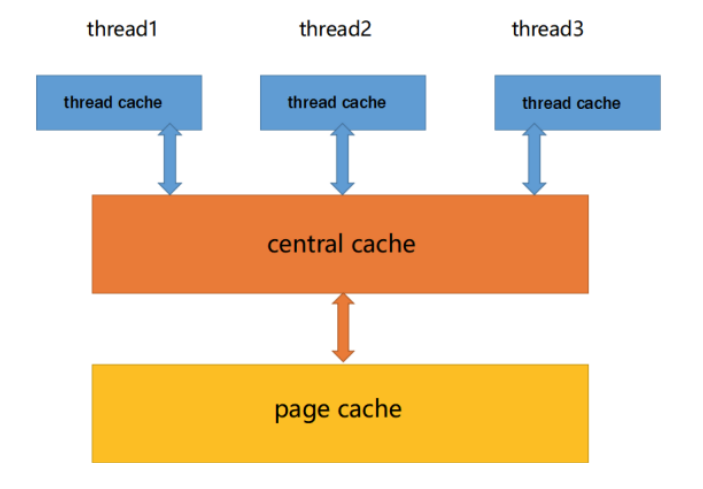
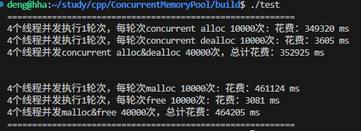
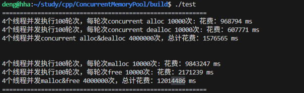
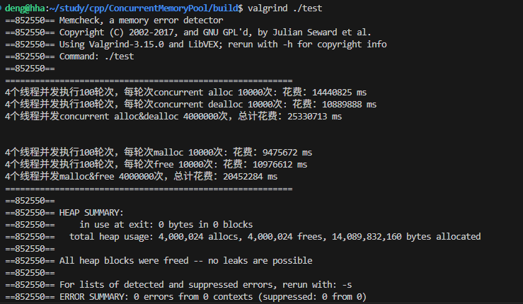

# 高并发内存池

当前项目是实现一个高并发的内存池，原型是google的一个开源项目tcmalloc，tcmalloc全称Thread-Caching Malloc，即线程缓存的malloc，实现了高效的多线程内存管理，用于替代系统的内存分配相关的函数（malloc、free）。

## 内存池的作用
1. 解决频繁的申请释放内存的效率问题。（空间换时间）
2. 直接在堆上申请释放资源造成的内存碎片问题。（）

## 整体架构

## 性能比较
4个线程并发执行1轮此，每轮申请和释放10000次。

4个线程并发执行100轮此，每轮申请和释放10000次。

经检查无内存泄漏

## 感谢
> 感谢大佬“先搞面包再谈爱”的[解析](https://blog.csdn.net/m0_62782700/article/details/135443352)。